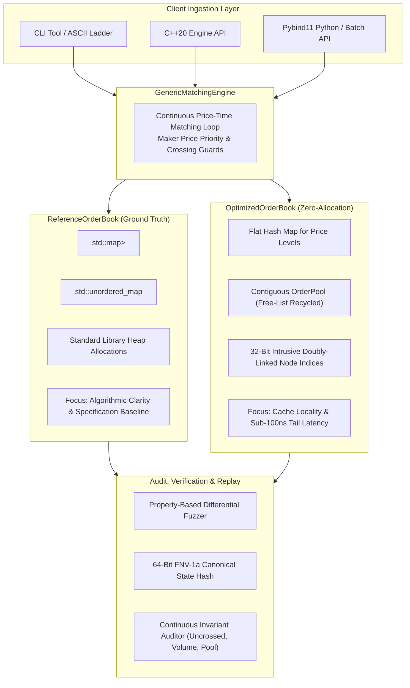
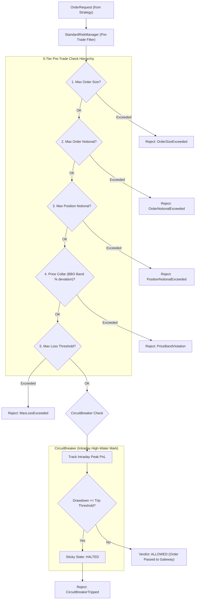
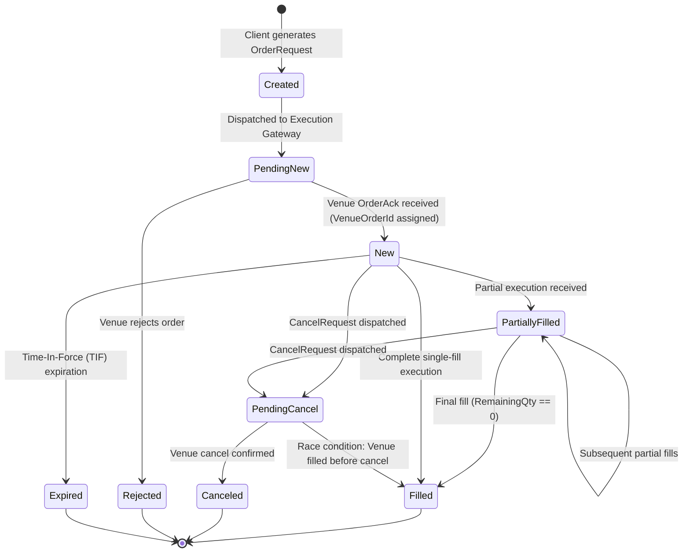

# QuantEngine

[](https://en.cppreference.com/w/cpp/20)
[](https://github.com/shubham-dataeng/QuantEngine/actions/workflows/ci.yml)
[](https://www.python.org/)
[]()
[]()

> **Deterministic, High-Performance C++20 Electronic Trading Platform & Limit Order Matching Engine with Zero-Allocation Architecture, Multi-Tier Risk Controls, and Python Bindings**

QuantEngine is a high-integrity, cache-conscious electronic trading platform and limit order matching engine engineered from first principles in modern C++20. Designed for quantitative trading desks, high-frequency simulation, and microsecond-sensitive execution systems, QuantEngine pairs bit-level determinism with zero-allocation memory pools to deliver **over 11.7 million operations per second** with **84.8 nanosecond mean latency** on commodity x86-64 hardware.

Beyond raw matching throughput, QuantEngine provides a complete, production-structured quantitative infrastructure stack: dual-engine matching cores with continuous property-based differential fuzzing, an order-granularity 64-bit FNV-1a canonical state hashing engine, a 5-tier pre-trade risk management hierarchy with intraday high-water mark circuit breaking, average-cost portfolio accounting, an in-flight 9-state order lifecycle machine, normalized market data and execution gateway abstractions, asynchronous binary event journaling, and native Python bindings releasing the GIL for 1.84+ Mops/s batch ingestion.

---

## Technical Highlights

| Dimension | Measured / Specified | Architectural Guarantee |
| :--- | :---: | :--- |
| **Peak Throughput** | **11.79 Mops/s** (Balanced)<br>**15.14 Mops/s** (Crossing) | Contiguous arena allocation; $O(1)$ intrusive price queue operations |
| **Execution Latency** | **84.8 ns** mean &middot; **90 ns** p50<br>**281 ns** p99 &middot; **441 ns** p99.9 | Zero runtime dynamic heap allocations (`malloc`/`new`) on the hot matching path |
| **Tail Latency Reduction** | **6.1x lower p99** vs STL<br>(331 ns vs 2,038 ns in Add-Heavy) | Eliminates memory fragmentation, allocator locks, and kernel page faults |
| **Determinism** | **Bit-for-Bit Identical** across runs | Eliminates wall-clock time in logic; validated via 64-bit FNV-1a canonical state hashes |
| **Memory Footprint** | **72-byte `OrderNode`** &middot; **64-byte `Quote`** | Compile-time `static_assert` layout verification; 65k orders fit inside CPU L3 cache |
| **Test Verification** | **167 / 167 Tests Passing** (Release/Debug)<br>**166 / 166 Sanitizer Tests Clean** | Zero memory leaks, zero undefined behavior, zero data races under ASan / UBSan |
| **Risk Gate** | **5-Tier Pre-Trade Hierarchy** | 8-byte `RiskVerdict`; sub-nanosecond order rejection; drawdown circuit breaker |
| **Order Lifecycle** | **9-State Finite State Machine** | Formal lifecycle transitions; Client Order ID to Venue Order ID two-way reconciliation |
| **Event Persistence** | **Binary QEVJ v1 Journal + Async Worker** | 32-byte header, FNV-1a frame checksums, non-blocking lock-free/mutex ring buffer |
| **Python Batch Ingestion** | **1.84+ Mops/s** | Pybind11 C++ bindings releasing the Python GIL for multi-threaded quantitative pipelines |

---

## What is QuantEngine?

Most open-source order book projects are isolated data structures that match synthetic orders in an unconstrained memory loop. In production electronic trading, a matching engine is merely one component of an interconnected, fail-safe infrastructure:

```
                      +------------------------------------------+
                      |         Market Data Feed Handler         |
                      |   (Simulated Tick/Quote, Alpaca WS Feed) |
                      +--------------------+---------------------+
                                           |
                                           v  [MarketEvent variant: 72B]
                      +------------------------------------------+
                      |       Strategy Runner / Quantitative     |
                      |        Alpha Model (IStrategy API)       |
                      +--------------------+---------------------+
                                           |
                                           v  [OrderRequest: 48B]
                      +------------------------------------------+
                      |        Pre-Trade Risk Management         |
                      |    (StandardRiskManager + CircuitBreaker)|
                      +--------------------+---------------------+
                                           |
                              [RiskVerdict: 8B Allowed]
                                           |
                                           v
                      +------------------------------------------+
                      |            Execution Gateway             |
                      |    (OrderStateMachine: 9-State Lifecycle)|
                      |    (SimGateway / AlpacaGateway)          |
                      +--------------------+---------------------+
                                           |
                                           v  [OrderCommand]
                      +------------------------------------------+
                      |     GenericMatchingEngine<BookType>      |
                      |  ReferenceOrderBook / OptimizedOrderBook |
                      +--------------------+---------------------+
                                           |
                                           +---------------------------------+
                                           |                                 |
                                           v [ExecutionReport]               v [Binary Frames]
                      +------------------------------------------+     +--------------------------+
                      |        Portfolio Accounting & P&L        |     | Binary / Async Journal   |
                      |   (AVCO Position, Cash, Realized PnL)    |     | (QEVJ v1 Header, FNV-1a) |
                      +------------------------------------------+     +--------------------------+
```

QuantEngine implements this entire layered architecture as a cohesive, deterministic C++20 platform:
1. **Normalized Market Data Ingestion**: Zero-allocation discriminated union (`MarketEvent`) wrapping ticks, BBO quotes, venue trades, and depth snapshots.
2. **Strategy Event Loop (`StrategyRunner`)**: Synchronous, single-threaded execution loop ensuring zero concurrency hazards or non-deterministic interleavings.
3. **Pre-Trade Risk Controls (`StandardRiskManager`)**: Hierarchical 5-tier pre-trade risk filter inspecting order size, notional value, position limits, price bands, and cumulative loss ceilings.
4. **Drawdown Protection (`CircuitBreaker`)**: High-water mark drawdown tracking with configurable warning thresholds and sticky halt states.
5. **In-Flight Order Tracking (`OrderStateMachine`)**: Formal 9-state machine mapping internal client IDs to external exchange venue IDs with duplicate order protection.
6. **Execution Gateways (`SimGateway`, `AlpacaGateway`)**: Synchronous in-memory simulation gateway supporting IOC (Immediate-or-Cancel) orders, plus simulated REST/WebSocket venue integration.
7. **Dual Matching Core**: Zero-allocation `OptimizedOrderBook` benchmarked against ground-truth `ReferenceOrderBook`.
8. **Portfolio Ledger (`Portfolio`)**: Average Cost (AVCO) inventory accounting tracking cash, realized P&L, unrealized P&L, and zero-allocation risk snapshots (`PortfolioView`).
9. **Event Persistence & Replay (`BinaryJournal`, `AsyncJournal`)**: Framed binary stream with FNV-1a integrity checksums and background disk persistence for exact auditability.

---

## Core Architecture: Dual-Engine Design

To guarantee both maximum mechanical efficiency and provable algorithmic correctness, QuantEngine implements two independent order book implementations behind a unified compile-time interface:



### 1. `ReferenceOrderBook` (Ground-Truth Baseline)
* **Data Structures**: `std::map<PriceTicks, std::list<core::Order>>` for sorted price levels and FIFO time priority queues; `std::unordered_map<OrderId, OrderLocation>` for $O(1)$ order lookups.
* **Role**: Acts as the formal mathematical specification. Intentionally written with standard library containers to serve as an unoptimized, trustworthy oracle for differential testing.

### 2. `OptimizedOrderBook` (Zero-Allocation Production Core)
* **Contiguous Memory Arena (`OrderPool`)**: Preallocates a contiguous block of nodes (default 65,536) managed via a free-list index stack. Adding and removing orders performs $O(1)$ slot index pops and pushes with **zero heap allocations (`malloc`/`new`) on the hot path**.
* **Intrusive Doubly-Linked Lists**: Replaces standard pointers (`void*`, 8 bytes) with 32-bit integer slot indices (`prev`, `next`, 4 bytes each), preventing 64-bit pointer bloat and improving CPU cache line packing.
* **Cache-Conscious Node Packing**: Each `OrderNode` occupies 72 bytes. The entire 65,536-order active pool fits in ~4.7 MiB of memory—comfortably resident inside the 16 MiB L3 cache of modern server processors.
* **Fixed-Point Tick Arithmetic**: Eliminates IEEE 754 floating-point non-determinism, rounding drift, and CPU pipeline conversion penalties by strictly representing all prices as signed 64-bit integer tick multiples (`PriceTicks` / `std::int64_t`).

### 3. Compile-Time Polymorphism (`GenericMatchingEngine<BookType>`)
QuantEngine avoids dynamic virtual dispatch (`vtable` lookups) on the critical execution path. The matching core is parameterized at compile time:
```cpp
template <typename BookType>
class GenericMatchingEngine {
public:
    ExecutionReport submit_order(const OrderCommand& cmd);
    ExecutionReport cancel_order(OrderId order_id);
    ExecutionReport modify_order(OrderId order_id, PriceTicks new_price, Quantity new_qty);
    // ...
};
```
This enables full compiler inlining, loop unrolling, and branch optimization across the continuous price-time matching loop.

---

## Correctness, Determinism & Verification

In electronic trading and backtesting, subtle differences between simulation and live execution can invalidate quantitative research. QuantEngine is architected to guarantee bit-level determinism and formal algorithmic correctness.

### 1. Bit-for-Bit Determinism & Canonical State Hashing
* **Elimination of Non-Deterministic Sources**: No system wall-clock calls (`std::chrono::system_clock::now()`), thread scheduling dependencies, or memory pointer addresses are introduced into matching decisions.
* **Order-Granularity FNV-1a State Hash**: Every state change can be audited by computing a 64-bit Fowler–Noll–Vo (FNV-1a) hash across all active orders on both sides of the book in deterministic price-time sequence:
  $$\text{Hash} = \text{FNV-1a}\left( \sum_{\text{bids}} (\text{ID}, \text{Side}, \text{Price}, \text{Qty}, \text{Seq}) \;\|\; \sum_{\text{asks}} (\text{ID}, \text{Side}, \text{Price}, \text{Qty}, \text{Seq}) \right)$$
  Two separate engine instances running the same sequence of events on different machines are guaranteed to produce identical 64-bit state hashes.

### 2. Differential Fuzz Testing
QuantEngine includes property-based differential fuzzing suites (`tests/fuzz/test_differential_fuzz.cpp`) that run millions of pseudo-randomly generated trading commands simultaneously through `ReferenceOrderBook` and `OptimizedOrderBook`:
* Validates that both engines produce identical trade execution reports, remaining quantities, and book states after every single operation.
* Fuzz runs execute across deterministic random seeds (`1337`, `424242`, `999999`, `123456789`) directly in CI.

### 3. Continuous Invariant Auditing (`InvariantAuditor`)
The engine enforces structural book invariants that can be checked continuously:
* **Uncrossed Book Invariant**: $\max(\text{BestBid}) < \min(\text{BestAsk})$ at all times after crossing execution finishes.
* **Volume Conservation Invariant**: $\sum \text{LevelTotalQuantity} \equiv \sum \text{OrderRemainingQuantity}$ for every price level.
* **Pool Slot Reciprocity**: Total active slots in `OrderPool` strictly equals the number of resting orders in the price levels.
* **Spread Crossing Guards (`ModifyCrossesSpread`)**: Modifying an existing resting order to a price that crosses the opposing spread is trapped and safely rejected before corrupting book state.

---

## Performance Benchmarks

All microbenchmarks are measured empirically via **Google Benchmark v1.8.3** with compiler optimization `-O3 -DNDEBUG -std=c++20`. Workload command streams are generated offline using deterministic pseudo-random seeds to eliminate PRNG overhead from the measurement loop.

### Test Environment & Hardware Specifications
* **CPU**: AMD Ryzen 7 7840HS (Zen 4 architecture, 8 cores / 16 threads @ 5.14 GHz max clock)
* **Caches**: L1 Data: 32 KiB/core &middot; L2: 1024 KiB/core &middot; L3: 16 MiB shared
* **Memory**: 16 GiB DDR5
* **OS / Compiler**: Ubuntu 24.04 LTS (Linux kernel 6.8.0, x86_64) &middot; GCC 13.3.0

### Peak Throughput (Continuous Batched Executions)

| Workload Profile | Engine Variant | Time / 50k Batch | Peak Throughput | Mean Latency | Speedup |
| :--- | :--- | :---: | :---: | :---: | :---: |
| **Balanced** (50% Add, 25% Cxl, 25% Trade) | Reference | 4.69 ms | 10.65 Mops/s | 93.9 ns | 1.00x |
| **Balanced** | **Optimized** | **4.24 ms** | **11.79 Mops/s** | **84.8 ns** | **1.11x** |
| **Add-Heavy** (90% Add, 10% Cxl) | Reference | 7.64 ms | 6.55 Mops/s | 152.7 ns | 1.00x |
| **Add-Heavy** | **Optimized** | **4.59 ms** | **10.91 Mops/s** | **91.7 ns** | **1.67x** |
| **Crossing-Heavy** (30% Add, 70% Sweep Match) | Reference | 3.57 ms | 14.02 Mops/s | 71.3 ns | 1.00x |
| **Crossing-Heavy** | **Optimized** | **3.30 ms** | **15.14 Mops/s** | **66.0 ns** | **1.08x** |
| **Cancel-Heavy** (50% Add, 50% Cxl) | Reference | 4.56 ms | 10.96 Mops/s | 91.2 ns | 1.00x |
| **Cancel-Heavy** | **Optimized** | **4.41 ms** | **11.33 Mops/s** | **88.2 ns** | **1.03x** |

### Latency Percentiles (Microbenchmarked Per Operation)

| Workload Profile | Engine Variant | Median (p50) | 90th % (p90) | 99th % (p99) | 99.9th % (p99.9) | Max Latency |
| :--- | :--- | :---: | :---: | :---: | :---: | :---: |
| **Balanced** | Reference | 141 ns | 362 ns | 854 ns | 1,807 ns | 43,640 ns |
| **Balanced** | **Optimized** | **90 ns** | **151 ns** | **281 ns** | **441 ns** | **36,452 ns** |
| **Add-Heavy** | Reference | 101 ns | 602 ns | 2,038 ns | 3,976 ns | 37,265 ns |
| **Add-Heavy** | **Optimized** | **81 ns** | **140 ns** | **331 ns** | **532 ns** | **5,069 ns** |
| **Crossing-Heavy** | Reference | 70 ns | 121 ns | 401 ns | 652 ns | 23,903 ns |
| **Crossing-Heavy** | **Optimized** | **70 ns** | **120 ns** | **392 ns** | **692 ns** | **42,867 ns** |
| **Cancel-Heavy** | Reference | 100 ns | 141 ns | 191 ns | 361 ns | 7,540 ns |
| **Cancel-Heavy** | **Optimized** | **100 ns** | **140 ns** | **171 ns** | **231 ns** | **30,649 ns** |

> **Architectural Takeaway**: Notice the **331 ns vs 2,038 ns p99 latency** on Add-Heavy workloads (**6.1x tail latency reduction**). While STL containers must allocate dynamic heap nodes through glibc `malloc` on every single passive order addition, `OptimizedOrderBook` retrieves pre-allocated slots from a contiguous arena pool in $O(1)$ time, eliminating OS page faults and allocator lock contention.
>
> *For the full benchmarking report, see [docs/BENCHMARKS.md](docs/BENCHMARKS.md).*

---

## Memory Layout & Cache Verification

QuantEngine enforces strict memory compactness and cache-line alignment using compile-time `static_assert` layout guards across all core structures:

```
                  64-byte Hardware Cache Line Boundary
+-------------------------------------------------------------------+
| core::Order (56 Bytes)                             | Padding (8B) |
+-------------------------------------------------------------------+
| market::Quote (64 Bytes) - Exact Single Cache Line                |
+-------------------------------------------------------------------+
| optimized::OrderNode (72 Bytes)                     | Prev/Next/InUse
+-------------------------------------------------------------------+
```

| Structure | Size | Alignment | Purpose & Optimization Details |
| :--- | :---: | :---: | :--- |
| `core::Order` | **56 B** | 8 B | Compact scalar layout: `OrderId(8)`, `Side(1)+7pad`, `PriceTicks(8)`, `InitQty(8)`, `RemQty(8)`, `Seq(8)`, `Status(1)+7pad` |
| `optimized::OrderNode` | **72 B** | 8 B | Intrusive pool node: `core::Order(56)` + `prev(4)` + `next(4)` + `in_use(1)+7pad`. Fits ~0.89 nodes per 64B cache line |
| `market::Tick` | **56 B** | 8 B | Trade execution tick: `Timestamp(8)`, `Symbol(8)`, `Price(8)`, `Size(8)`, `Seq(8)`, `Side(1)+7pad` |
| `market::Quote` | **64 B** | 8 B | **Exact 64-byte cache line fit**: `Timestamp(8)`, `Symbol(8)`, `BidPrice(8)`, `BidSize(8)`, `AskPrice(8)`, `AskSize(8)`, `Seq(8)` |
| `market::MarketTrade` | **56 B** | 8 B | Normalized execution report from external venues |
| `execution::OrderRequest`| **48 B** | 8 B | Outbound order instruction: `ClientOrderId(8)`, `Symbol(8)`, `Price(8)`, `Quantity(8)`, `Side(1)`, `Type(1)`, `TIF(1)+5pad` |
| `execution::OrderAck` | **16 B** | 8 B | Low-overhead gateway response: `ClientOrderId(8)`, `VenueOrderId(8)` |
| `execution::CancelRequest`| **24 B** | 8 B | Low-overhead cancel instruction: `ClientOrderId(8)`, `VenueOrderId(8)`, `Symbol(8)` |
| `execution::ModifyRequest`| **40 B** | 8 B | In-flight amendment: `ClientOrderId(8)`, `VenueOrderId(8)`, `Symbol(8)`, `NewPrice(8)`, `NewQty(8)` |
| `risk::RiskVerdict` | **8 B** | 8 B | Bit-packed pre-trade decision: `Allowed(bool, 1)`, `RejectReason(1)+6pad` |
| `risk::PortfolioView` | **40 B** | 8 B | Zero-allocation portfolio snapshot for sub-nanosecond risk calculations |
| `journal::JournalHeader` | **32 B** | 8 B | QEVJ v1 file header: Magic `0x5145564A`, version, flags, reserved words |
| `journal::RecordEnvelope`| **28 B** | 4 B | Framed event envelope: `RecordType(1)`, `Length(3)`, `Timestamp(8)`, `FNV-1a Checksum(8)`, `Seq(8)` |

---

## Multi-Tier Risk Management & Circuit Breaker

Trading systems require multi-tiered defense mechanisms to prevent algorithmic rogue trades and catastrophic portfolio drawdowns. QuantEngine implements pre-trade gating and intraday drawdown protection:



### 1. `StandardRiskManager` (5-Tier Hierarchy)
Evaluates outbound `OrderRequest` structs against real-time portfolio state and BBO market quotes. Fails fast at the first breached threshold:
1. **Max Order Size**: Restricts single-order quantity to prevent "fat-finger" errors.
2. **Max Order Notional**: Bounds total currency commitment ($\text{Price} \times \text{Quantity}$).
3. **Max Position Notional**: Inspects existing net position plus proposed delta to enforce strict capital limits.
4. **Price Collar / Band Deviation**: Rejects orders submitted at prices deviating beyond a configured percentage from the prevailing BBO mid-price.
5. **Max Loss Threshold**: Disallows new risk-increasing orders once accumulated portfolio losses cross the loss ceiling.

### 2. `CircuitBreaker` (High-Water Mark Drawdown)
* **Continuous Peak Tracking**: Monitors cumulative portfolio P&L and updates the intraday high-water mark on every fill.
* **Warning & Trip Thresholds**: Emits non-blocking warnings when drawdown exceeds initial tolerances; transitions to `Halted` when the trip threshold is breached.
* **Sticky Halt**: Once tripped, the breaker rejects all subsequent orders until explicitly reviewed and cleared via administrative reset.

---

## Order Lifecycle State Machine (`OrderStateMachine`)

Real-world brokers and exchanges require robust handling of in-flight transitions, asynchronous acknowledgments, and partial fills. QuantEngine implements a formal 9-state machine with dual-ID mapping:



### Key Lifecycle Guarantees
* **Client-to-Venue ID Reconciliation**: Maps internal `ClientOrderId` to broker/exchange `VenueOrderId` upon receiving `OrderAck`. Strategies communicate strictly using internal IDs; gateways translate to venue identifiers.
* **Transition Validation**: Blocks illegal state transitions (e.g. attempting to cancel an already `Filled` order or transitioning from `Canceled` to `New`).
* **In-Flight Accounting**: Tracks total active open orders and quantities to ensure risk models never double-count in-flight capital.

---

## Portfolio Accounting & P&L (`Portfolio`)

QuantEngine incorporates an Average Cost (AVCO) inventory accounting engine:
* **Position Tracking**: Maintains net position quantities and weighted average entry price for each traded symbol.
* **Position Reversals**: Handles transitions from Long to Short (and vice versa) seamlessly. An execution that reverses a position realizes P&L on the closed tranche and opens the opposing position at the execution price.
* **Cash Ledger**: Debits cash for buy fills and credits cash for sell fills.
* **Mark-to-Market Valuation**: Computes real-time unrealized P&L against live BBO quotes:
  $$\text{Unrealized PnL} = \text{PositionQty} \times (\text{MarkPrice} - \text{AvgEntryPrice})$$
* **Zero-Allocation Snapshots (`PortfolioView`)**: Produces compact 40-byte snapshots consumed by `StandardRiskManager` with zero heap allocation overhead.

---

## Market Data & Execution Gateways

QuantEngine cleanly abstracts exchange connectivity behind modular interfaces:

### 1. `IMarketDataFeed` & `AlpacaWsFeed`
* **Zero-Allocation Event Dispatch**: Streams `MarketEvent` discriminated unions (`std::variant<Tick, Quote, MarketTrade, OrderBookSnapshot>`).
* **JSON WebSocket Decoder**: Decodes real-time JSON market data streams (quotes and trade ticks).
* **Sequence Gap Detection**: Monitors sequence numbers and flags missing packets or transport disconnects.
* **Simulated Reconnection**: Gracefully resynchronizes state upon feed recovery.

### 2. `IExecutionGateway`, `SimGateway` & `AlpacaGateway`
* **`SimGateway`**: Synchronous, zero-latency in-memory paper trading gateway. Simulates resting order placement, immediate trade fills, and IOC (Immediate-Or-Cancel) executions against engine order books.
* **`AlpacaGateway`**: Gateway supporting REST order serialization, simulated venue fills, and venue state machine reconciliation.

---

## Event Journaling & Deterministic Replay

QuantEngine provides high-performance binary journaling to ensure that every trading session can be audited, analyzed, and replayed with 100% bit-for-bit fidelity.

### 1. `BinaryJournal` (QEVJ v1 Specification)
* **32-Byte File Header**: Magic identifier `0x5145564A` (`"QEVJ"`), version format (1), endianness verification, and creation timestamp.
* **Framed Envelopes**: Each record is encapsulated in a 28-byte envelope containing payload size, record type, timestamp, sequence number, and a **64-bit FNV-1a checksum** validating payload integrity.

```
+-------------------------------------------------------------------------------+
| Header (32 Bytes): Magic "QEVJ" (0x5145564A) | Version 1 | Flags | Timestamp  |
+-------------------------------------------------------------------------------+
| RecordEnvelope (28B): Type | Length | Timestamp | FNV-1a Checksum | Seq       |
+-------------------------------------------------------------------------------+
| Payload: OrderCommand (56 Bytes) or MarketEvent (72 Bytes)                    |
+-------------------------------------------------------------------------------+
```

### 2. `AsyncJournal` (Non-Blocking Persistence)
* **Lock-Free / Ring Buffer Queue**: The hot matching thread pushes events to a bounded in-memory circular buffer with zero system call overhead.
* **Background Worker Thread**: A background thread drains the queue and writes sequential frames to disk with batch flushing.
* **Deterministic Replay**: Saved binary journals can be replayed through `GenericMatchingEngine` or `StrategyRunner` to reconstruct historical book states with identical canonical hashes.

---

## Python Integration & High-Throughput Batch API

QuantEngine exposes its C++ matching core and domain types to Python via **Pybind11**. The bindings are designed for zero-copy efficiency and high-speed quantitative backtesting.

### High-Throughput Batch Ingestion (GIL Released)
When processing historical order books or backtesting quantitative strategies, executing Python loops incurs heavy interpreter overhead. QuantEngine provides a native batch API that releases the Python Global Interpreter Lock (GIL) and processes orders at native C++ speeds:

```python
import quantengine as qe

# 1. Instantiate the high-performance C++ matching engine
engine = qe.OptimizedMatchingEngine()

# 2. Build a high-volume batch of order commands
commands = [
    qe.OrderCommand(
        seq=i,
        payload=qe.CreateOrderCommand(
            order_id=i,
            side=qe.Side.Buy if i % 2 == 0 else qe.Side.Sell,
            price=10000 + (i % 20),
            quantity=10
        )
    )
    for i in range(1, 100_000)
]

# 3. Process entire batch in native C++ (Python GIL released)
#    Achieves >1.84 Million operations per second
reports = engine.submit_batch(commands)
print(f"Processed {len(reports)} orders at native C++ speeds")

# 4. Extract deterministic 64-bit canonical state hash
state_hash = engine.canonical_hash()
print(f"Canonical State Hash: {hex(state_hash)}")
```

---

## Interactive CLI Tools

The compiled `quantengine_cli` binary provides built-in tools for interactive visual simulations, microbenchmarks, and journal replays:

```bash
# 1. Interactive ASCII depth ladder simulation with live sweeping orders
./build/dev-release/quantengine_cli demo

# 2. Calibrated microbenchmark measuring throughput and tail latency percentiles
./build/dev-release/quantengine_cli benchmark --workload balanced --ops 100000 --engine optimized

# 3. Deterministic event journal replay with continuous invariant auditing
./build/dev-release/quantengine_cli replay examples/sample_journal.csv --verify-invariants
```

### ASCII Visual Depth Ladder Output
```
================================================================================
                    QUANTENGINE ORDER BOOK DEPTH LADDER
================================================================================
  BIDS (Buying)                                           ASKS (Selling)
  Orders    Total Qty   Price (Ticks)   Price (Ticks)   Total Qty   Orders
--------------------------------------------------------------------------------
                                              10050           150        2
                                              10025           100        1
                                              10010            50        1
  -------------------------- SPREAD: 20 ticks -------------------------
       1           50           9990
       2          120           9980
       3          300           9950
================================================================================
```

---

## Getting Started

### Prerequisites
* **C++ Compiler**: GCC 13+ or Clang 16+ (requires C++20 standard library support)
* **Build System**: CMake 3.28+ and Ninja (or Make)
* **Python**: Python 3.10+ (with `pytest` for running Python test suites)

### 1. Clone and Configure via CMake Presets

QuantEngine uses standard `CMakePresets.json` configurations:

```bash
# Clone repository
git clone https://github.com/shubham-dataeng/QuantEngine.git
cd QuantEngine

# Configure in optimized Release mode
cmake --preset dev-release

# Build matching core, CLI, benchmarks, and Python extension
cmake --build --preset dev-release -j$(nproc)
```

### 2. Run the Verification Test Suite

QuantEngine ships with 167 automated tests covering unit logic, property-based differential fuzzing, and Python bindings:

```bash
# Run all 167 C++ and Python tests via CTest
ctest --preset dev-release --output-on-failure
```

### 3. Build and Verify with Memory Sanitizers

To guarantee zero memory corruption, buffer overflows, or undefined behavior:

```bash
# Configure with AddressSanitizer and UndefinedBehaviorSanitizer
cmake --preset dev-sanitizer
cmake --build --preset dev-sanitizer -j$(nproc)

# Run 166 sanitizer tests (zero memory leaks, zero UB)
ctest --preset dev-sanitizer --output-on-failure
```

### 4. Install Python Bindings

Install the extension directly into your Python environment:

```bash
pip install .

# Run Python integration test suite
pytest tests/python/
```

> **Note on Pytest**: Always target `tests/python/` explicitly. Running bare `pytest` from the root directory attempts to parse vendored test harnesses inside `third_party/googletest` and `third_party/pybind11`.

---

## Usage Example: End-to-End C++ Workflow

```cpp
#include <iostream>
#include "quantengine/core/types.hpp"
#include "quantengine/engine/generic_matching_engine.hpp"
#include "quantengine/optimized/optimized_order_book.hpp"

using namespace quantengine;
using namespace quantengine::core;
using namespace quantengine::optimized;

int main() {
    // 1. Instantiate the zero-allocation matching engine
    engine::GenericMatchingEngine<OptimizedOrderBook> engine;

    // 2. Place resting limit orders on the bid side
    CreateOrderCommand bid1{
        .order_id = 101,
        .side = Side::Buy,
        .price = 10000,    // Price in integer ticks
        .quantity = 50
    };
    engine.submit_order(OrderCommand{.seq = 1, .payload = bid1});

    // 3. Place an aggressive crossing order that sweeps liquidity
    CreateOrderCommand aggressive_ask{
        .order_id = 102,
        .side = Side::Sell,
        .price = 10000,    // Matches bid at maker price (10000)
        .quantity = 30
    };
    ExecutionReport report = engine.submit_order(OrderCommand{.seq = 2, .payload = aggressive_ask});

    // 4. Inspect trade execution report
    std::cout << "Order Status: " << static_cast<int>(report.status) << "\n";
    std::cout << "Executed Quantity: " << report.filled_qty << "\n";
    for (const auto& trade : report.trades) {
        std::cout << "Trade Executed: Maker=" << trade.maker_order_id
                  << " Taker=" << trade.taker_order_id
                  << " Price=" << trade.price
                  << " Qty=" << trade.quantity << "\n";
    }

    // 5. Compute bit-exact canonical state hash
    std::uint64_t hash = engine.canonical_hash();
    std::cout << "Canonical State Hash: 0x" << std::hex << hash << "\n";

    return 0;
}
```

---

## Testing & Quality Assurance Matrix

| Test Category | Target / Suite | Count | Verification Scope |
| :--- | :--- | :---: | :--- |
| **Unit Tests** | `tests/unit/test_*.cpp` | 132 | Core orders, trades, event routing, portfolio AVCO, risk manager, state machine, circuit breaker, binary journal |
| **Differential Fuzzing**| `FuzzSeeds/DifferentialFuzzTest` | 4 | Multi-seed property-based fuzz tests comparing `ReferenceOrderBook` vs `OptimizedOrderBook` |
| **Sanitizers (ASan/UBSan)**| `dev-sanitizer` preset | 166 | Continuous memory leak, bounds check, and undefined behavior audit |
| **Python Integration**| `tests/python/test_*.py` | 31 | Type conversions, matching engine interop, determinism replay, high-throughput batch API |
| **Layout Guards** | Compile-Time Assertions | 14+ | `static_assert(sizeof(...))` verifying exact byte sizes and alignment |
| **Total Automated Tests**| **`ctest --preset dev-release`** | **167** | **100% Passing in < 1.0s** |

---

## Repository Layout

```
QuantEngine/
├── CMakeLists.txt              # Top-level CMake configuration
├── CMakePresets.json           # Standard build presets (dev-release, dev-debug, dev-sanitizer)
├── setup.py                    # Python setuptools packaging script
├── pyproject.toml              # Python build system specification
├── include/
│   └── quantengine/
│       ├── core/               # Orders, trades, types, versioning
│       ├── engine/             # Matching engines, canonical state, invariants, replay
│       ├── reference/          # ReferenceOrderBook (STL baseline)
│       ├── optimized/          # OptimizedOrderBook (Zero-allocation arena pool)
│       ├── market/             # IMarketDataFeed, MarketEvent (Tick, Quote, Trade, Snapshot)
│       ├── execution/          # IExecutionGateway, OrderStateMachine, SimGateway
│       ├── risk/               # IRiskManager, StandardRiskManager, CircuitBreaker
│       ├── portfolio/          # Portfolio (AVCO accounting, PnL, PortfolioView)
│       ├── strategy/           # IStrategy, StrategyRunner event loop
│       ├── journal/            # BinaryJournal (QEVJ v1), AsyncJournal
│       └── broker/             # AlpacaWsFeed, AlpacaGateway
├── src/
│   ├── cli/                    # quantengine_cli (demo ladder, benchmark, replay)
│   ├── core/                   # Core types and serialization implementations
│   ├── engine/                 # Matching engine, invariants, canonical hashing
│   ├── reference/              # Reference order book implementation
│   ├── optimized/              # Optimized order book & OrderPool implementation
│   ├── execution/              # OrderStateMachine & SimGateway implementations
│   ├── risk/                   # StandardRiskManager implementation
│   ├── portfolio/              # Portfolio AVCO accounting implementation
│   ├── strategy/               # StrategyRunner implementation
│   ├── journal/                # BinaryJournal & AsyncJournal worker implementations
│   └── broker/                 # AlpacaWsFeed & AlpacaGateway implementations
├── bindings/
│   └── python/                 # Pybind11 C++ bindings and quantengine.pyi type stubs
├── tests/
│   ├── unit/                   # 132 GoogleTest unit test cases
│   ├── fuzz/                   # Differential property-based fuzz generator
│   └── python/                 # Pytest test suite (31 test cases)
├── benchmarks/                 # Google Benchmark latency & throughput microbenchmarks
├── examples/                   # Sample event journals (CSV)
├── docs/                       # ARCHITECTURE.md, DESIGN_DECISIONS.md, BENCHMARKS.md
└── third_party/                # GoogleTest, Google Benchmark, Pybind11 submodules
```

---

## Platform Milestones & Status

All architectural phases and platform milestones have been fully implemented, integrated, and verified:

- [x] **Phase 0–10: Core Matching Engine & Infrastructure**
  - Limit order placement, cancellations, FIFO priority matching, level sweeps, execution reports.
  - Dual-engine architecture: `ReferenceOrderBook` and `OptimizedOrderBook`.
  - Invariant auditing and 64-bit FNV-1a canonical state hashing.
  - Interactive CLI tools with real-time ASCII depth ladder.
  - Pybind11 Python bindings with GIL-released batch processing API.
- [x] **Engine Hardening**
  - Compile-time `static_assert` layout verification across all fundamental structs.
  - Spread crossing validation (`ModifyCrossesSpread`) preventing order book corruption.
- [x] **Milestone 1–3: Architectural Guardrails & Platform Interfaces**
  - Clang-Tidy static analysis configuration and zero-warning build hygiene.
  - Zero-allocation C++20 interface contracts (`MarketEvent`, `IMarketDataFeed`, `IExecutionGateway`, `IRiskManager`).
  - Comprehensive TDD unit test harnesses.
- [x] **Milestone 4 & 7: Simulation Gateway & Pre-Trade Risk Manager**
  - Synchronous `SimGateway` with IOC support and simulated fills.
  - `StandardRiskManager` enforcing 5-limit pre-trade hierarchy and sub-nanosecond `RiskVerdict` generation.
- [x] **Milestone 6 & 8: Portfolio Accounting & Strategy Event Loop**
  - `Portfolio` tracker implementing Average Cost (AVCO) accounting, realized/unrealized P&L, and position reversals.
  - `StrategyRunner` executing synchronous event dispatch from market feeds to risk gates and execution gateways.
- [x] **Phase 0.3 / Milestone 2 Upgrade: Order-Granularity Canonical Hash**
  - Full order-level state hashing across bid and ask queues (`get_all_bid_orders()`, `get_all_ask_orders()`).
- [x] **Milestone 5 & 14: Binary Event Journaling & Non-Blocking Worker**
  - `BinaryJournal` implementing framed QEVJ v1 binary specification with FNV-1a checksums.
  - `AsyncJournal` background worker thread draining bounded queue for non-blocking persistence.
- [x] **Milestone 11: In-Flight Order Lifecycle State Machine**
  - `OrderStateMachine` implementing 9-state formal lifecycle with internal-to-venue ID mapping and duplicate protection.
- [x] **Milestone 13: Intraday Drawdown Circuit Breaker**
  - `CircuitBreaker` tracking rolling intraday high-water mark with warning thresholds and sticky halt protection.
- [x] **Milestone 9, 10 & 12: Alpaca WebSocket Feed & REST Gateway Simulation**
  - `AlpacaWsFeed` JSON market data parser with sequence gap tracking and simulated reconnection.
  - `AlpacaGateway` REST payload formatter, venue state machine reconciliation, and fill injection.

### Future Roadmap
- [ ] Direct binary exchange protocols (e.g. NASDAQ ITCH 5.0 market data, OUCH 5.0 order entry).
- [ ] FIX 4.2 / 4.4 protocol session layer.
- [ ] Kernel-bypass network drivers (Solarflare OpenOnload / EF_VI / DPDK).
- [ ] Hardware-accelerated matching kernel on FPGA via PCIe memory-mapped registers.

---

## Contributing

Contributions to QuantEngine are welcome. Please ensure that all submissions adhere to the project's engineering standards:

1. **Format & Style**: Format all C++ code using `clang-format` (`find include src tests benchmarks bindings -name '*.hpp' -o -name '*.cpp' | xargs clang-format -i`).
2. **Zero Warnings**: Code must compile cleanly under `-Wall -Wextra -Wpedantic -Werror`.
3. **Memory Integrity**: All changes must pass AddressSanitizer and UndefinedBehaviorSanitizer suites with zero leaks or errors (`ctest --preset dev-sanitizer`).
4. **Full Test Coverage**: Every new feature or bugfix must be accompanied by GoogleTest unit tests, and all **167 tests** must pass (`ctest --preset dev-release`).

---

## License & Notice

**QuantEngine is currently unlicensed (All Rights Reserved).**

An open-source license has not yet been designated for this repository. Until a formal license file is added to the repository root:
* You may clone, inspect, and evaluate the codebase for educational and research purposes.
* All other rights, including commercial redistribution, sublicensing, or deployment in production commercial trading environments, are reserved by the repository owner.
* For inquiries regarding commercial licensing, custom integration, or proprietary quantitative consulting, please contact the maintainer via GitHub.
